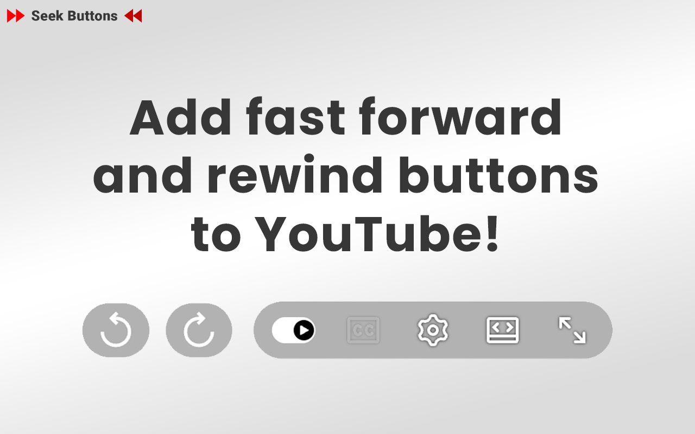
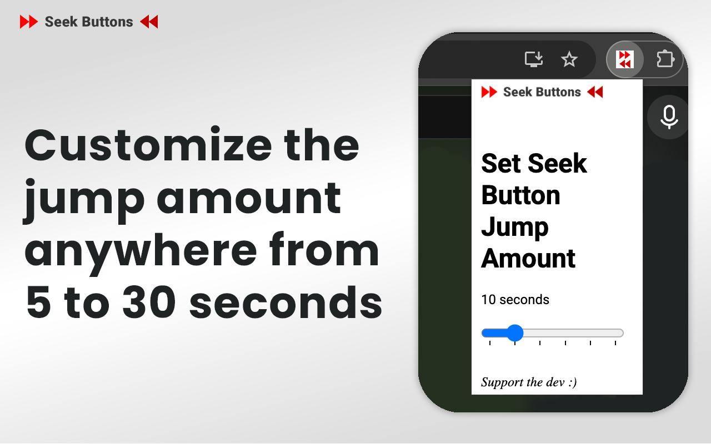

# Seek Buttons for YouTube
This Chrome extension adds rewind and fast forward buttons to YouTube's video player.

By default each button jumps 10 seconds. Users may set the jump amount anywhere from 5 to 30 seconds in the extension's popup.

# Installation

Install from the [Chrome Web Store](https://chromewebstore.google.com/detail/seek-buttons-for-youtube/echjglbmhomlekpgohmfgpamfohkfoip)

---

# Connect With Me
- [GitHub: jonny-berry](https://github.com/jonny-berry)
- [YouTube: @jonnyDevvs](https://www.youtube.com/@JonnyDevvs)
- [Twitter: @jonnyDevvs](https://x.com/jonnyDevvs)
- [Email: jonnydevvs@gmail.com](mailto:jonnydevvs@gmail.com)